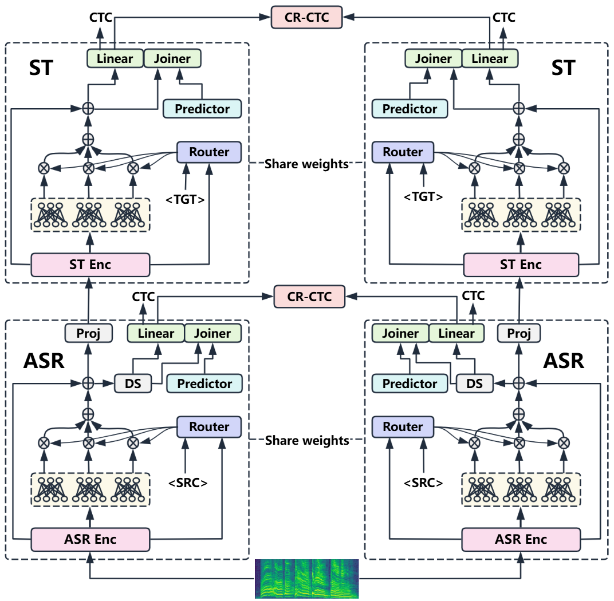

# Introduction
Neural transducers provide an alignment-free framework for joint automatic speech recognition (ASR) and speech translation (ST). Hierarchical transducer architectures further improve multilingual speech-to-text modeling by stacking a translation-focused encoder on top of an ASR encoder to better handle reordering. However, scaling hierarchical transducers to multilingual many-to-many settings remains challenging: fully shared models often suffer from negative transfer and unstable target-language generation, while training separate models per direction is computationally prohibitive. We propose LCMA-SRT (Language-Conditional Mixture-of-Experts Adapters for Speech Recognition and Translation), which augments a hierarchical transducer with language-conditional Mixture-of-Experts (MoE) adapters. A source-conditioned MoE adapter (SRC-MoE) routes using the source-language embedding to improve acoustic–phonetic modeling and reduce cross-language interference for ASR. A target-conditioned MoE adapter (TGT-MoE) routes using the desired target language to guide reordering and lexical selection and to mitigate cross-target interference in many-to-many ST. Experiments on Europarl-ST (9 languages, 72 directions) show that LCMA-SRT improves both ASR and ST within a single joint model, reducing average WER and increasing BLEU and COMET over strong hierarchical transducer baselines.

# Installation
Please refer to [document](https://k2-fsa.github.io/icefall/installation/index.html) for installation.
# Europarl-ST
Please refer to this page to download the data: [Europarl-ST](https://www.mllp.upv.es/europarl-st/) 

# Checkpoint
The model checkpoints are available for anonymous review on Figshare: checkpoints
# Main Results
## Multilingual ASR Pretraining
**WER (%) ↓**
| Model     |   de |   en |   es |   fr |   it |   nl |   pl |   pt |   ro |  Avg |
|:----------|-----:|-----:|-----:|-----:|-----:|-----:|-----:|-----:|-----:|-----:|
| CR-CTC    | 24.57| 18.59| 20.76| 19.24| 17.33| 36.75| 25.28| 19.82| 18.77| 22.35|
|   + MoE     | 24.39| 18.41| 20.16| 18.61| 17.28| 36.83| 24.36| 19.70| 18.79| 22.06|
|   + S-Bias  | 23.89| 17.60| 19.58| 17.41| 16.73| **34.72**| 23.63| 18.21| 17.97| 21.08|
|   + SRC-MoE  | **23.34**| **17.45**| **19.41**| **17.34**| **16.27**| 35.20| **23.28**| **18.16**| **17.48**| **20.88**|
## Many-to-Many Joint Training (Average)
<table>
  <thead>
    <tr>
      <th rowspan="2">Model</th>
      <th rowspan="2">WER (%)↓</th>
      <th colspan="10">Average BLEU ↑</th>
    </tr>
    <tr>
      <th>de</th><th>en</th><th>es</th><th>fr</th><th>it</th><th>nl</th><th>pl</th><th>pt</th><th>ro</th><th>Avg</th>
    </tr>
  </thead>
  <tbody>
    <tr>
      <td>HENT-SRT-M20×9</td>
      <td>23.28</td>
      <td>10.7</td><td>21.2</td><td>19.1</td><td>18.2</td><td>14.2</td><td>16.5</td><td>7.2</td><td>18.4</td><td>12.1</td><td>15.3</td>
    </tr>
    <tr>
      <td>HENT-SRT-M2M</td>
      <td>16.65</td>
      <td>2.6</td><td>12.8</td><td>5.5</td><td>4.0</td><td>1.8</td><td>3.5</td><td>1.2</td><td>4.9</td><td>2.5</td><td>4.3</td>
    </tr>
    <tr>
      <td>LCMA-SRT</td>
      <td><strong>15.71</strong></td>
      <td><strong>15.2</strong></td><td><strong>25.9</strong></td><td><strong>25.8</strong></td><td><strong>24.7</strong></td>
      <td><strong>20.0</strong></td><td><strong>20.5</strong></td><td><strong>10.7</strong></td><td><strong>23.9</strong></td><td><strong>17.6</strong></td><td><strong>20.5</strong></td>
    </tr>
    <tr>
      <td>TGT-MoE→MoE</td>
      <td>16.42</td>
      <td>2.3</td><td>14.7</td><td>4.7</td><td>3.3</td><td>1.7</td><td>2.7</td><td>1.1</td><td>4.5</td><td>2.0</td><td>4.1</td>
    </tr>
    <tr>
      <td>TGT-MoE→T-Bias</td>
      <td>15.84</td>
      <td>13.1</td><td>22.7</td><td>23.5</td><td>22.3</td><td>17.7</td><td>18.1</td><td>8.3</td><td>21.8</td><td>14.5</td><td>18.0</td>
    </tr>
    <tr>
      <td>w/o TGT-MoE</td>
      <td>16.48</td>
      <td>2.0</td><td>12.8</td><td>5.9</td><td>3.9</td><td>1.6</td><td>3.0</td><td>1.3</td><td>5.0</td><td>2.2</td><td>4.2</td>
    </tr>
    <tr>
      <td>w/o SRC-MoE</td>
      <td>16.11</td>
      <td>14.5</td><td>24.9</td><td>25.0</td><td>24.6</td><td>19.6</td><td>20.0</td><td>10.5</td><td>23.7</td><td>17.5</td><td>20.0</td>
    </tr>
  </tbody>
</table>

<table>
  <thead>
    <tr>
      <th rowspan="2">Model</th>
      <th rowspan="2">LMR (%)↓</th>
      <th colspan="10">Average COMET ↑</th>
    </tr>
    <tr>
      <th>de</th><th>en</th><th>es</th><th>fr</th><th>it</th><th>nl</th><th>pl</th><th>pt</th><th>ro</th><th>Avg</th>
    </tr>
  </thead>
  <tbody>
    <tr>
      <td>HENT-SRT-M20×9</td>
      <td>0.65</td>
      <td>0.507</td><td>0.656</td><td>0.587</td><td>0.542</td><td>0.565</td><td>0.558</td><td>0.550</td><td>0.609</td><td>0.598</td><td>0.575</td>
    </tr>
    <tr>
      <td>HENT-SRT-M2M</td>
      <td>84.95</td>
      <td>0.380</td><td>0.543</td><td>0.478</td><td>0.427</td><td>0.435</td><td>0.401</td><td>0.385</td><td>0.471</td><td>0.406</td><td>0.436</td>
    </tr>
    <tr>
      <td>LCMA-SRT</td>
      <td>0.75</td>
      <td><strong>0.574</strong></td><td><strong>0.715</strong></td><td><strong>0.682</strong></td><td><strong>0.627</strong></td>
      <td><strong>0.656</strong></td><td><strong>0.613</strong></td><td><strong>0.616</strong></td><td><strong>0.693</strong></td><td><strong>0.678</strong></td><td><strong>0.651</strong></td>
    </tr>
    <tr>
      <td>TGT-MoE→MoE</td>
      <td>85.23</td>
      <td>0.380</td><td>0.559</td><td>0.476</td><td>0.426</td><td>0.438</td><td>0.395</td><td>0.386</td><td>0.472</td><td>0.408</td><td>0.438</td>
    </tr>
    <tr>
      <td>TGT-MoE→T-Bias</td>
      <td>0.78</td>
      <td>0.529</td><td>0.675</td><td>0.642</td><td>0.583</td><td>0.612</td><td>0.563</td><td>0.562</td><td>0.651</td><td>0.621</td><td>0.604</td>
    </tr>
    <tr>
      <td>w/o TGT-MoE</td>
      <td>85.19</td>
      <td>0.376</td><td>0.545</td><td>0.480</td><td>0.427</td><td>0.434</td><td>0.398</td><td>0.387</td><td>0.473</td><td>0.407</td><td>0.436</td>
    </tr>
    <tr>
      <td>w/o SRC-MoE</td>
      <td>0.81</td>
      <td>0.568</td><td>0.708</td><td>0.671</td><td>0.621</td><td>0.646</td><td>0.606</td><td>0.605</td><td>0.685</td><td>0.675</td><td>0.643</td>
    </tr>
  </tbody>
</table>

## Many-to-Many Joint Training (All directions)
### HENT-SRT(Many-to-One)
**Bleu/Comet ↑**
| src\tgt | DE | EN | ES | FR | IT | NL | PL | PT | RO |
| --- | --- | --- | --- | --- | --- | --- | --- | --- | --- |
| DE | \- | 17.5/0.615 | 13.3/0.531 | 12.1/0.479 | 8.7/0.504 | 16.2/0.549 | 5.9/0.521 | 12.4/0.544 | 8.3/0.545 |
| EN | 15.4/0.571 | \- | 26.0/0.641 | 24.6/0.606 | 19.0/0.625 | 21.9/0.620 | 9.7/0.584 | 23.1/0.668 | 19.8/0.680 |
| ES | 9.9/0.488 | 22.1/0.652 | \- | 20.2/0.548 | 15.7/0.571 | 15.1/0.534 | 6.9/0.546 | 22.4/0.636 | 12.2/0.589 |
| FR | 11.0/0.499 | 23.5/0.685 | 20.3/0.603 | \- | 17.6/0.603 | 16.9/0.551 | 7.4/0.555 | 23.3/0.650 | 13.0/0.618 |
| IT | 11.3/0.507 | 23.0/0.679 | 21.3/0.614 | 20.3/0.569 | \- | 16.1/0.551 | 8.3/0.568 | 22.4/0.650 | 13.4/0.623 |
| NL | 7.1/0.444 | 15.6/0.581 | 11.3/0.500 | 10.4/0.460 | 7.3/0.467 | \- | 3.7/0.486 | 10.4/0.509 | 6.3/0.509 |
| PL | 9.5/0.515 | 19.3/0.643 | 17.1/0.568 | 15.7/0.518 | 11.9/0.545 | 14.3/0.543 | \- | 14.6/0.584 | 10.0/0.583 |
| PT | 10.9/0.522 | 23.7/0.692 | 22.1/0.631 | 21.3/0.584 | 17.3/0.605 | 15.6/0.556 | 7.5/0.576 | \- | 13.9/0.636 |
| RO | 10.9/0.514 | 25.3/0.697 | 21.4/0.606 | 21.4/0.575 | 15.8/0.596 | 16.0/0.563 | 7.9/0.569 | 18.8/0.627 | \- |

**LMR (%) ↓**

| src\tgt | DE | EN | ES | FR | IT | NL | PL | PT | RO |
| --- | --- | --- | --- | --- | --- | --- | --- | --- | --- |
| DE | \- | 0.08 | 0.70 | 0.64 | 0.66 | 1.00 | 0.00 | 3.39 | 1.70 |
| EN | 0.00 | \- | 0.79 | 0.25 | 0.35 | 0.65 | 0.16 | 1.98 | 1.64 |
| ES | 0.18 | 0.22 | \- | 0.18 | 0.46 | 1.01 | 0.09 | 1.19 | 0.88 |
| FR | 0.00 | 0.11 | 0.55 | \- | 0.00 | 0.26 | 0.18 | 1.55 | 1.16 |
| IT | 0.11 | 0.00 | 0.57 | 0.23 | \- | 0.36 | 0.25 | 2.20 | 0.54 |
| NL | 0.09 | 0.34 | 0.49 | 0.49 | 0.90 | \- | 0.21 | 3.18 | 1.60 |
| PL | 0.00 | 0.22 | 0.72 | 0.16 | 0.42 | 1.80 | \- | 2.08 | 1.72 |
| PT | 0.00 | 0.17 | 0.16 | 0.16 | 0.08 | 0.41 | 0.08 | \- | 0.81 |
| RO | 0.00 | 0.15 | 0.42 | 0.26 | 0.77 | 0.91 | 0.00 | 1.58 | \- |

**WER (%) ↓**

| src\tgt | DE | EN | ES | FR | IT | NL | PL | PT | RO |
| --- | --- | --- | --- | --- | --- | --- | --- | --- | --- |
| DE | \- | 21.80 | 26.64 | 27.12 | 27.44 | 26.43 | 26.51 | 26.51 | 26.62 |
| EN | 16.42 | \- | 17.32 | 17.56 | 17.08 | 17.45 | 17.29 | 17.18 | 17.21 |
| ES | 21.29 | 17.77 | \- | 22.25 | 22.83 | 22.68 | 21.93 | 22.82 | 22.66 |
| FR | 19.37 | 16.07 | 19.82 | \- | 20.41 | 19.30 | 19.45 | 19.86 | 20.80 |
| IT | 18.18 | 15.05 | 19.19 | 19.32 | \- | 19.06 | 18.60 | 19.00 | 19.91 |
| NL | 38.99 | 32.95 | 38.85 | 38.85 | 39.52 | \- | 38.99 | 39.32 | 39.26 |
| PL | 25.89 | 22.01 | 26.33 | 27.19 | 25.99 | 26.47 | \- | 27.13 | 27.36 |
| PT | 19.90 | 16.27 | 21.74 | 20.82 | 20.77 | 20.99 | 20.48 | \- | 20.53 |
| RO | 22.32 | 15.85 | 21.87 | 22.04 | 23.97 | 22.88 | 23.63 | 22.82 | \- |

### HENT-SRT(Many-to-Many)
**Bleu/Comet ↑**
| src\tgt | DE | EN | ES | FR | IT | NL | PL | PT | RO |
| --- | --- | --- | --- | --- | --- | --- | --- | --- | --- |
| DE | \- | 11.0/0.522 | 3.7/0.453 | 3.3/0.407 | 1.1/0.409 | 4.1/0.397 | 1.6/0.383 | 4.0/0.447 | 2.2/0.391 |
| EN | 4.0/0.421 | \- | 9.7/0.533 | 6.5/0.470 | 3.1/0.487 | 5.3/0.430 | 1.6/0.419 | 7.1/0.524 | 4.5/0.458 |
| ES | 2.1/0.357 | 13.4/0.536 | \- | 3.9/0.416 | 1.5/0.424 | 3.1/0.385 | 0.9/0.374 | 5.4/0.464 | 2.2/0.396 |
| FR | 2.9/0.373 | 11.9/0.535 | 6.4/0.484 | \- | 2.2/0.440 | 4.0/0.396 | 1.3/0.385 | 6.5/0.481 | 2.4/0.408 |
| IT | 2.9/0.372 | 14.7/0.560 | 5.1/0.477 | 4.0/0.425 | \- | 3.2/0.393 | 1.7/0.380 | 5.6/0.472 | 2.0/0.404 |
| NL | 2.3/0.367 | 9.8/0.508 | 3.1/0.435 | 2.6/0.397 | 1.2/0.402 | \- | 0.9/0.365 | 2.9/0.435 | 1.9/0.380 |
| PL | 2.4/0.385 | 12.1/0.539 | 4.6/0.469 | 3.8/0.424 | 1.6/0.429 | 3.4/0.397 | \- | 3.8/0.462 | 2.1/0.401 |
| PT | 2.3/0.381 | 13.3/0.557 | 6.6/0.491 | 4.0/0.439 | 1.9/0.444 | 3.0/0.402 | 1.1/0.390 | \- | 2.5/0.409 |
| RO | 1.9/0.381 | 16.4/0.585 | 4.6/0.487 | 3.7/0.443 | 1.5/0.446 | 2.2/0.408 | 0.7/0.386 | 3.9/0.480 | \- |

**LMR (%) ↓**

| src\tgt | DE | EN | ES | FR | IT | NL | PL | PT | RO |
| --- | --- | --- | --- | --- | --- | --- | --- | --- | --- |
| DE | \- | 56.60 | 87.83 | 90.14 | 94.98 | 77.09 | 83.11 | 83.75 | 82.55 |
| EN | 78.21 | \- | 78.93 | 86.08 | 95.93 | 78.54 | 85.14 | 81.62 | 80.55 |
| ES | 88.51 | 58.54 | \- | 92.98 | 96.76 | 89.58 | 90.93 | 80.07 | 86.81 |
| FR | 85.18 | 71.51 | 87.89 | \- | 95.60 | 86.66 | 89.85 | 77.71 | 84.93 |
| IT | 88.54 | 57.23 | 92.05 | 94.25 | \- | 91.61 | 92.77 | 86.59 | 90.38 |
| NL | 78.25 | 56.62 | 88.85 | 89.02 | 93.71 | \- | 86.96 | 82.91 | 81.98 |
| PL | 82.54 | 60.55 | 89.70 | 91.34 | 96.01 | 86.68 | \- | 83.45 | 87.29 |
| PT | 88.36 | 65.79 | 86.39 | 91.99 | 97.51 | 90.31 | 90.80 | \- | 87.09 |
| RO | 90.98 | 50.74 | 93.27 | 95.33 | 98.46 | 93.14 | 93.04 | 89.42 | \- |

**WER (%) ↓**

| src\tgt | DE | EN | ES | FR | IT | NL | PL | PT | RO |
| --- | --- | --- | --- | --- | --- | --- | --- | --- | --- |
| DE | \- | 19.09 | 18.77 | 18.82 | 19.09 | 18.86 | 18.79 | 18.99 | 18.86 |
| EN | 13.92 | \- | 13.94 | 14.02 | 13.79 | 13.84 | 13.99 | 13.90 | 13.53 |
| ES | 15.96 | 15.80 | \- | 15.91 | 15.69 | 15.97 | 15.85 | 15.89 | 15.75 |
| FR | 13.40 | 13.38 | 13.28 | \- | 13.42 | 13.36 | 13.39 | 13.38 | 13.37 |
| IT | 13.10 | 13.19 | 13.13 | 13.24 | \- | 13.17 | 12.98 | 13.18 | 13.27 |
| NL | 28.59 | 28.65 | 28.73 | 28.46 | 28.62 | \- | 28.46 | 28.46 | 28.47 |
| PL | 18.26 | 18.27 | 18.14 | 18.21 | 17.87 | 18.27 | \- | 18.29 | 18.00 |
| PT | 13.60 | 13.59 | 13.52 | 13.59 | 13.38 | 13.58 | 13.57 | \- | 13.34 |
| RO | 14.59 | 14.20 | 14.52 | 14.42 | 14.17 | 14.59 | 14.49 | 14.65 | \- |

### LCMA-SRT(ASRenc+SRC-MOE+STenc+TGT-MOE)
**Bleu/Comet ↑**
| src\tgt | DE | EN | ES | FR | IT | NL | PL | PT | RO |
| --- | --- | --- | --- | --- | --- | --- | --- | --- | --- |
| DE | \- | 22.0/0.683 | 19.7/0.624 | 20.2/0.572 | 14.5/0.591 | 19.0/0.604 | 8.9/0.591 | 18.7/0.636 | 13.5/0.627 |
| EN | 20.1/0.638 | \- | 33.4/0.741 | 30.7/0.690 | 25.0/0.714 | 25.4/0.674 | 14.7/0.663 | 29.4/0.749 | 26.3/0.765 |
| ES | 13.7/0.544 | 26.1/0.708 | \- | 26.3/0.627 | 21.0/0.657 | 19.4/0.584 | 10.3/0.609 | 26.6/0.709 | 17.7/0.663 |
| FR | 14.9/0.561 | 28.6/0.737 | 27.0/0.700 | \- | 22.5/0.685 | 21.3/0.603 | 11.1/0.616 | 27.5/0.723 | 18.3/0.701 |
| IT | 14.8/0.560 | 27.0/0.728 | 27.3/0.698 | 25.3/0.640 | \- | 20.2/0.600 | 11.0/0.619 | 26.1/0.717 | 17.8/0.686 |
| NL | 12.1/0.538 | 21.0/0.660 | 17.6/0.595 | 16.5/0.544 | 13.6/0.561 | \- | 7.0/0.556 | 16.9/0.604 | 11.6/0.593 |
| PL | 14.3/0.584 | 23.9/0.709 | 24.1/0.667 | 22.9/0.612 | 18.6/0.651 | 19.5/0.608 | \- | 20.8/0.683 | 16.5/0.677 |
| PT | 15.4/0.581 | 28.1/0.744 | 28.3/0.722 | 27.0/0.662 | 22.8/0.695 | 19.7/0.609 | 10.5/0.632 | \- | 19.0/0.710 |
| RO | 15.8/0.587 | 30.1/0.753 | 28.9/0.711 | 28.4/0.667 | 22.1/0.696 | 19.7/0.624 | 12.2/0.642 | 25.3/0.724 | \- |

**LMR (%) ↓**

| src\tgt | DE | EN | ES | FR | IT | NL | PL | PT | RO |
| --- | --- | --- | --- | --- | --- | --- | --- | --- | --- |
| DE | \- | 0.38 | 0.49 | 0.43 | 0.58 | 0.84 | 0.73 | 2.38 | 1.79 |
| EN | 0.08 | \- | 0.95 | 0.16 | 0.09 | 0.24 | 0.40 | 1.98 | 1.64 |
| ES | 0.54 | 0.61 | \- | 0.37 | 0.65 | 0.92 | 0.38 | 1.29 | 1.54 |
| FR | 0.00 | 0.33 | 0.73 | \- | 0.38 | 0.87 | 0.36 | 1.91 | 1.16 |
| IT | 0.11 | 0.42 | 0.91 | 0.23 | \- | 0.84 | 0.37 | 1.62 | 0.95 |
| NL | 0.19 | 0.86 | 1.19 | 0.79 | 0.79 | \- | 0.62 | 1.80 | 1.94 |
| PL | 0.00 | 0.40 | 0.80 | 0.48 | 0.85 | 1.14 | \- | 1.60 | 1.01 |
| PT | 0.16 | 0.39 | 0.08 | 0.24 | 0.08 | 0.81 | 0.50 | \- | 1.17 |
| RO | 0.16 | 0.56 | 0.50 | 0.17 | 0.77 | 1.24 | 0.43 | 1.33 | \- |

**WER (%) ↓**

| src\tgt | DE | EN | ES | FR | IT | NL | PL | PT | RO |
| --- | --- | --- | --- | --- | --- | --- | --- | --- | --- |
| DE | \- | 18.01 | 17.84 | 17.85 | 18.23 | 17.92 | 17.75 | 17.93 | 17.99 |
| EN | 12.94 | \- | 12.93 | 13.02 | 12.84 | 12.87 | 12.92 | 12.97 | 12.64 |
| ES | 15.30 | 15.14 | \- | 15.27 | 15.02 | 15.31 | 15.26 | 15.25 | 15.14 |
| FR | 12.58 | 12.51 | 12.53 | \- | 12.51 | 12.50 | 12.56 | 12.55 | 12.65 |
| IT | 12.50 | 12.41 | 12.52 | 12.63 | \- | 12.59 | 12.42 | 12.62 | 12.66 |
| NL | 27.01 | 27.23 | 26.89 | 26.91 | 27.20 | \- | 26.93 | 27.07 | 26.82 |
| PL | 17.54 | 17.39 | 17.32 | 17.36 | 17.01 | 17.43 | \- | 17.57 | 17.11 |
| PT | 12.37 | 12.72 | 12.28 | 12.37 | 12.08 | 12.38 | 12.40 | \- | 12.19 |
| RO | 13.64 | 13.29 | 13.51 | 13.46 | 13.38 | 13.61 | 13.54 | 13.72 | \- |

### LCMA-SRT(ASR+SRC-MOE+STenc+T-Bias)
**Bleu/Comet ↑**
| src\tgt | DE | EN | ES | FR | IT | NL | PL | PT | RO |
| --- | --- | --- | --- | --- | --- | --- | --- | --- | --- |
| DE | \- | 19.6/0.640 | 18.0/0.590 | 18.0/0.533 | 12.5/0.557 | 16.5/0.546 | 6.9/0.542 | 17.0/0.601 | 11.5/0.572 |
| EN | 17.4/0.582 | \- | 30.0/0.696 | 27.3/0.637 | 22.4/0.664 | 22.1/0.612 | 11.2/0.590 | 26.2/0.704 | 21.1/0.693 |
| ES | 11.8/0.503 | 23.3/0.669 | \- | 23.7/0.579 | 18.4/0.609 | 17.3/0.539 | 7.7/0.556 | 23.7/0.665 | 14.8/0.608 |
| FR | 13.3/0.519 | 24.8/0.696 | 24.7/0.658 | \- | 20.1/0.636 | 18.5/0.555 | 9.0/0.566 | 25.0/0.674 | 15.2/0.637 |
| IT | 12.9/0.520 | 23.5/0.689 | 24.9/0.657 | 22.7/0.593 | \- | 17.3/0.553 | 8.8/0.570 | 24.1/0.672 | 14.2/0.630 |
| NL | 10.1/0.493 | 18.1/0.615 | 16.3/0.556 | 15.3/0.510 | 11.7/0.527 | \- | 4.9/0.512 | 15.5/0.569 | 10.0/0.549 |
| PL | 12.3/0.539 | 21.5/0.669 | 22.1/0.633 | 21.1/0.572 | 16.5/0.605 | 17.6/0.561 | \- | 19.4/0.645 | 13.4/0.624 |
| PT | 13.6/0.541 | 24.9/0.708 | 25.6/0.684 | 24.9/0.623 | 20.7/0.654 | 18.0/0.566 | 8.8/0.585 | \- | 16.1/0.654 |
| RO | 13.7/0.537 | 25.9/0.713 | 26.3/0.665 | 25.4/0.616 | 19.6/0.644 | 17.6/0.574 | 9.1/0.574 | 23.3/0.680 | \- |

**LMR (%) ↓**

| src\tgt | DE | EN | ES | FR | IT | NL | PL | PT | RO |
| --- | --- | --- | --- | --- | --- | --- | --- | --- | --- |
| DE | \- | 0.34 | 0.56 | 0.64 | 0.82 | 1.84 | 0.36 | 2.89 | 1.62 |
| EN | 0.32 | \- | 0.71 | 0.25 | 0.27 | 0.49 | 0.32 | 2.38 | 1.28 |
| ES | 0.36 | 0.61 | \- | 0.28 | 0.37 | 1.28 | 0.19 | 1.47 | 1.10 |
| FR | 0.18 | 0.39 | 0.36 | \- | 0.19 | 1.31 | 0.27 | 0.91 | 1.37 |
| IT | 0.44 | 0.12 | 0.45 | 0.45 | \- | 0.72 | 0.00 | 1.73 | 1.49 |
| NL | 0.47 | 0.52 | 1.38 | 0.69 | 0.79 | \- | 0.83 | 4.03 | 1.71 |
| PL | 0.39 | 0.49 | 1.04 | 0.32 | 0.51 | 1.47 | \- | 1.44 | 1.31 |
| PT | 0.24 | 0.48 | 0.24 | 0.24 | 0.00 | 0.90 | 0.08 | \- | 0.81 |
| RO | 0.08 | 0.31 | 0.42 | 0.17 | 0.34 | 0.83 | 0.17 | 2.00 | \- |

**WER (%) ↓**

| src\tgt | DE | EN | ES | FR | IT | NL | PL | PT | RO |
| --- | --- | --- | --- | --- | --- | --- | --- | --- | --- |
| DE | \- | 18.13 | 17.88 | 17.86 | 18.16 | 17.92 | 17.80 | 17.93 | 17.97 |
| EN | 13.26 | \- | 13.25 | 13.35 | 13.05 | 13.16 | 13.26 | 13.25 | 12.94 |
| ES | 15.19 | 15.13 | \- | 15.21 | 15.03 | 15.21 | 15.14 | 15.11 | 14.89 |
| FR | 12.53 | 12.49 | 12.37 | \- | 12.47 | 12.45 | 12.48 | 12.52 | 12.51 |
| IT | 12.67 | 12.63 | 12.77 | 12.80 | \- | 12.74 | 12.67 | 12.84 | 12.95 |
| NL | 27.33 | 27.39 | 27.28 | 27.17 | 27.57 | \- | 27.32 | 27.29 | 27.26 |
| PL | 17.56 | 17.32 | 17.42 | 17.45 | 17.06 | 17.41 | \- | 17.50 | 17.37 |
| PT | 12.53 | 12.72 | 12.50 | 12.55 | 12.30 | 12.52 | 12.57 | \- | 12.30 |
| RO | 13.99 | 13.63 | 13.93 | 13.82 | 13.62 | 13.98 | 13.88 | 14.01 | \- |

### LCMA-SRT(ASRenc+SRC-MOE+STenc+MOE)
**Bleu/Comet ↑**
| src\tgt | DE | EN | ES | FR | IT | NL | PL | PT | RO |
| --- | --- | --- | --- | --- | --- | --- | --- | --- | --- |
| DE | \- | 12.4/0.528 | 3.2/0.451 | 2.1/0.400 | 1.0/0.412 | 2.8/0.383 | 1.4/0.377 | 3.7/0.446 | 2.1/0.393 |
| EN | 3.8/0.422 | \- | 9.9/0.535 | 6.0/0.467 | 3.1/0.495 | 4.6/0.424 | 1.3/0.421 | 7.5/0.528 | 4.1/0.463 |
| ES | 2.0/0.361 | 13.9/0.541 | \- | 3.5/0.416 | 1.6/0.430 | 2.3/0.377 | 1.1/0.375 | 5.0/0.468 | 1.9/0.394 |
| FR | 2.6/0.379 | 13.8/0.552 | 5.2/0.482 | \- | 2.0/0.442 | 3.0/0.391 | 1.3/0.385 | 5.9/0.482 | 2.1/0.410 |
| IT | 2.6/0.374 | 16.8/0.578 | 4.3/0.476 | 3.0/0.428 | \- | 2.6/0.391 | 1.6/0.385 | 5.2/0.478 | 1.7/0.412 |
| NL | 1.7/0.359 | 12.0/0.532 | 2.1/0.431 | 1.8/0.395 | 0.9/0.403 | \- | 0.6/0.367 | 2.1/0.432 | 1.2/0.378 |
| PL | 2.2/0.380 | 13.9/0.552 | 3.7/0.464 | 3.0/0.419 | 1.5/0.431 | 2.2/0.388 | \- | 3.2/0.462 | 1.4/0.402 |
| PT | 1.9/0.381 | 17.4/0.594 | 4.7/0.482 | 3.4/0.436 | 1.4/0.444 | 2.1/0.397 | 1.0/0.392 | \- | 1.7/0.409 |
| RO | 1.9/0.384 | 17.5/0.591 | 4.1/0.486 | 3.4/0.443 | 1.6/0.449 | 1.8/0.405 | 0.7/0.388 | 3.4/0.484 | \- |

**LMR (%) ↓**

| src\tgt | DE | EN | ES | FR | IT | NL | PL | PT | RO |
| --- | --- | --- | --- | --- | --- | --- | --- | --- | --- |
| DE | \- | 44.09 | 91.70 | 93.43 | 96.22 | 87.51 | 88.57 | 86.63 | 84.42 |
| EN | 79.25 | \- | 82.40 | 85.26 | 95.75 | 81.54 | 87.16 | 79.24 | 79.45 |
| ES | 88.87 | 50.66 | \- | 93.16 | 96.85 | 92.59 | 92.63 | 82.09 | 88.68 |
| FR | 88.27 | 57.97 | 90.88 | \- | 96.84 | 90.66 | 90.82 | 81.88 | 85.76 |
| IT | 91.92 | 41.43 | 91.37 | 94.13 | \- | 94.36 | 93.87 | 87.40 | 89.70 |
| NL | 82.38 | 35.99 | 94.86 | 92.08 | 95.38 | \- | 89.00 | 86.94 | 86.99 |
| PL | 85.89 | 46.27 | 92.66 | 92.05 | 96.94 | 90.28 | \- | 88.57 | 88.70 |
| PT | 90.32 | 40.07 | 92.60 | 94.50 | 97.68 | 94.79 | 92.56 | \- | 91.43 |
| RO | 91.39 | 45.21 | 93.69 | 94.99 | 97.52 | 94.38 | 94.93 | 89.92 | \- |

**WER (%) ↓**

| src\tgt | DE | EN | ES | FR | IT | NL | PL | PT | RO |
| --- | --- | --- | --- | --- | --- | --- | --- | --- | --- |
| DE | \- | 18.83 | 18.76 | 18.75 | 18.92 | 18.74 | 18.61 | 18.81 | 18.85 |
| EN | 13.28 | \- | 13.27 | 13.33 | 13.14 | 13.18 | 13.31 | 13.34 | 12.88 |
| ES | 15.61 | 15.51 | \- | 15.65 | 15.41 | 15.60 | 15.56 | 15.52 | 15.57 |
| FR | 13.15 | 13.10 | 13.02 | \- | 13.08 | 12.99 | 13.15 | 13.16 | 13.27 |
| IT | 13.00 | 12.92 | 13.03 | 13.04 | \- | 13.05 | 12.89 | 13.11 | 13.27 |
| NL | 28.47 | 28.60 | 28.57 | 28.38 | 28.58 | \- | 28.34 | 28.47 | 28.34 |
| PL | 18.10 | 17.96 | 17.97 | 18.07 | 17.47 | 18.01 | \- | 18.14 | 17.67 |
| PT | 13.15 | 13.39 | 13.10 | 13.18 | 12.96 | 13.16 | 13.12 | \- | 12.91 |
| RO | 14.64 | 14.34 | 14.54 | 14.40 | 14.36 | 14.62 | 14.56 | 14.67 | \- |

### LCMA-SRT(ASRenc+SRC-MOE+STenc)
**Bleu/Comet ↑**
| src\tgt | DE | EN | ES | FR | IT | NL | PL | PT | RO |
| --- | --- | --- | --- | --- | --- | --- | --- | --- | --- |
| DE | \- | 11.4/0.524 | 4.1/0.454 | 3.0/0.407 | 1.0/0.408 | 3.4/0.393 | 1.5/0.381 | 4.0/0.448 | 2.2/0.391 |
| EN | 3.1/0.413 | \- | 10.6/0.540 | 6.1/0.469 | 2.9/0.488 | 4.5/0.428 | 1.4/0.423 | 7.5/0.532 | 4.1/0.459 |
| ES | 1.8/0.358 | 13.2/0.539 | \- | 3.7/0.419 | 1.4/0.425 | 2.5/0.382 | 1.1/0.376 | 5.5/0.466 | 2.2/0.394 |
| FR | 2.3/0.372 | 11.8/0.538 | 6.8/0.485 | \- | 2.2/0.440 | 3.4/0.393 | 1.5/0.385 | 6.1/0.484 | 2.3/0.411 |
| IT | 2.1/0.370 | 15.2/0.572 | 5.1/0.483 | 3.5/0.428 | \- | 2.8/0.393 | 1.7/0.384 | 5.4/0.476 | 1.8/0.411 |
| NL | 1.6/0.361 | 10.8/0.517 | 2.8/0.434 | 2.6/0.398 | 1.0/0.400 | \- | 1.1/0.372 | 2.7/0.433 | 1.4/0.377 |
| PL | 2.1/0.379 | 11.6/0.531 | 4.9/0.466 | 4.2/0.421 | 1.3/0.427 | 2.9/0.395 | \- | 4.0/0.461 | 2.0/0.402 |
| PT | 1.7/0.377 | 14.6/0.572 | 6.7/0.489 | 3.9/0.438 | 1.4/0.440 | 2.3/0.396 | 1.2/0.387 | \- | 1.8/0.409 |
| RO | 1.5/0.377 | 13.5/0.563 | 6.5/0.488 | 3.9/0.441 | 1.5/0.447 | 2.3/0.405 | 0.9/0.386 | 4.5/0.480 | \- |

**LMR (%) ↓**

| src\tgt | DE | EN | ES | FR | IT | NL | PL | PT | RO |
| --- | --- | --- | --- | --- | --- | --- | --- | --- | --- |
| DE | \- | 54.96 | 87.83 | 91.79 | 97.04 | 83.22 | 80.86 | 83.02 | 83.12 |
| EN | 83.56 | \- | 77.82 | 86.24 | 95.39 | 83.48 | 84.49 | 78.76 | 81.74 |
| ES | 91.56 | 55.95 | \- | 92.79 | 97.59 | 91.58 | 87.43 | 76.19 | 85.71 |
| FR | 88.91 | 70.85 | 87.41 | \- | 96.46 | 89.61 | 88.84 | 78.05 | 83.02 |
| IT | 92.36 | 47.80 | 91.37 | 95.94 | \- | 93.04 | 91.18 | 87.51 | 89.30 |
| NL | 83.47 | 49.05 | 88.42 | 89.30 | 95.72 | \- | 81.93 | 84.82 | 82.65 |
| PL | 86.52 | 64.23 | 89.31 | 91.49 | 97.28 | 89.13 | \- | 82.57 | 86.28 |
| PT | 91.50 | 54.86 | 85.19 | 92.93 | 98.76 | 93.65 | 90.22 | \- | 89.89 |
| RO | 92.61 | 65.55 | 87.96 | 94.64 | 98.80 | 92.81 | 91.92 | 86.75 | \- |

**WER (%) ↓**

| src\tgt | DE | EN | ES | FR | IT | NL | PL | PT | RO |
| --- | --- | --- | --- | --- | --- | --- | --- | --- | --- |
| DE | \- | 18.83 | 18.59 | 18.62 | 18.95 | 18.60 | 18.44 | 18.57 | 18.78 |
| EN | 13.41 | \- | 13.38 | 13.45 | 13.26 | 13.31 | 13.43 | 13.39 | 13.04 |
| ES | 15.96 | 15.81 | \- | 15.97 | 15.74 | 15.99 | 15.89 | 15.90 | 15.82 |
| FR | 12.75 | 12.77 | 12.62 | \- | 12.70 | 12.67 | 12.69 | 12.65 | 12.78 |
| IT | 12.91 | 12.91 | 12.97 | 13.03 | \- | 12.97 | 12.85 | 13.13 | 13.08 |
| NL | 28.71 | 28.80 | 28.57 | 28.56 | 28.75 | \- | 28.61 | 28.52 | 28.48 |
| PL | 18.30 | 18.14 | 18.02 | 18.18 | 17.85 | 18.17 | \- | 18.24 | 17.92 |
| PT | 13.12 | 13.29 | 13.01 | 13.12 | 12.95 | 13.09 | 13.06 | \- | 12.82 |
| RO | 15.04 | 14.96 | 14.91 | 14.92 | 14.77 | 15.05 | 14.99 | 15.11 | \- |

### LCMA-SRT(ASRenc+STenc+TGT-MOE)
**Bleu/Comet ↑**
| src\tgt | DE | EN | ES | FR | IT | NL | PL | PT | RO |
| --- | --- | --- | --- | --- | --- | --- | --- | --- | --- |
| DE | \- | 21.4/0.675 | 19.2/0.614 | 19.8/0.565 | 13.9/0.578 | 18.9/0.601 | 8.7/0.578 | 18.5/0.629 | 13.5/0.626 |
| EN | 19.6/0.626 | \- | 32.5/0.733 | 30.9/0.690 | 24.4/0.705 | 24.5/0.661 | 14.3/0.649 | 28.7/0.742 | 25.8/0.762 |
| ES | 13.3/0.541 | 25.1/0.702 | \- | 26.5/0.622 | 20.6/0.651 | 19.3/0.578 | 10.2/0.600 | 26.1/0.705 | 17.5/0.666 |
| FR | 14.1/0.553 | 27.3/0.730 | 25.9/0.685 | \- | 22.4/0.673 | 20.2/0.592 | 10.9/0.605 | 26.9/0.711 | 18.6/0.695 |
| IT | 14.0/0.558 | 26.0/0.722 | 26.8/0.693 | 25.1/0.635 | \- | 19.4/0.591 | 11.2/0.615 | 26.5/0.711 | 17.7/0.689 |
| NL | 11.8/0.528 | 20.0/0.651 | 17.5/0.582 | 16.8/0.538 | 12.8/0.550 | \- | 6.7/0.545 | 17.0/0.601 | 11.8/0.587 |
| PL | 13.5/0.575 | 23.3/0.698 | 22.6/0.655 | 22.3/0.596 | 18.0/0.634 | 19.2/0.601 | \- | 20.9/0.670 | 16.2/0.669 |
| PT | 14.5/0.577 | 26.7/0.738 | 27.5/0.710 | 27.1/0.656 | 22.5/0.688 | 19.0/0.604 | 10.6/0.624 | \- | 19.0/0.708 |
| RO | 15.0/0.582 | 29.2/0.747 | 27.7/0.699 | 28.3/0.662 | 21.8/0.687 | 19.2/0.618 | 11.8/0.628 | 24.7/0.714 | \- |

**LMR (%) ↓**

| src\tgt | DE | EN | ES | FR | IT | NL | PL | PT | RO |
| --- | --- | --- | --- | --- | --- | --- | --- | --- | --- |
| DE | \- | 0.38 | 0.84 | 0.86 | 1.48 | 0.92 | 0.58 | 3.10 | 1.62 |
| EN | 0.08 | \- | 0.55 | 0.08 | 0.53 | 0.40 | 0.32 | 2.38 | 1.83 |
| ES | 0.27 | 0.50 | \- | 0.55 | 0.74 | 0.82 | 0.47 | 1.47 | 1.43 |
| FR | 0.37 | 0.44 | 0.46 | \- | 0.57 | 0.61 | 0.27 | 1.18 | 1.90 |
| IT | 0.00 | 0.12 | 0.45 | 0.79 | \- | 0.72 | 0.12 | 1.50 | 0.81 |
| NL | 0.19 | 0.63 | 0.99 | 1.58 | 2.02 | \- | 1.04 | 2.23 | 2.17 |
| PL | 0.00 | 0.36 | 0.40 | 0.79 | 0.85 | 1.39 | \- | 1.60 | 1.21 |
| PT | 0.00 | 0.26 | 0.08 | 0.47 | 0.17 | 0.49 | 0.25 | \- | 1.08 |
| RO | 0.16 | 0.31 | 0.58 | 0.26 | 1.03 | 0.41 | 0.60 | 2.00 | \- |

**WER (%) ↓**

| src\tgt | DE | EN | ES | FR | IT | NL | PL | PT | RO |
| --- | --- | --- | --- | --- | --- | --- | --- | --- | --- |
| DE | \- | 18.66 | 18.35 | 18.33 | 18.65 | 18.41 | 18.30 | 18.51 | 18.50 |
| EN | 13.50 | \- | 13.49 | 13.61 | 13.46 | 13.39 | 13.53 | 13.48 | 13.13 |
| ES | 15.46 | 15.22 | \- | 15.41 | 15.16 | 15.46 | 15.34 | 15.35 | 15.11 |
| FR | 12.58 | 12.64 | 12.49 | \- | 12.55 | 12.65 | 12.56 | 12.64 | 12.74 |
| IT | 12.92 | 12.90 | 12.96 | 13.07 | \- | 13.07 | 12.84 | 13.12 | 13.13 |
| NL | 27.85 | 28.02 | 27.74 | 27.69 | 27.94 | \- | 27.65 | 27.77 | 27.55 |
| PL | 17.88 | 17.55 | 17.76 | 17.79 | 17.57 | 17.79 | \- | 18.00 | 17.70 |
| PT | 12.75 | 12.86 | 12.63 | 12.75 | 12.49 | 12.77 | 12.67 | \- | 12.48 |
| RO | 14.09 | 13.74 | 13.97 | 13.88 | 13.73 | 14.05 | 13.91 | 14.13 | \- |

